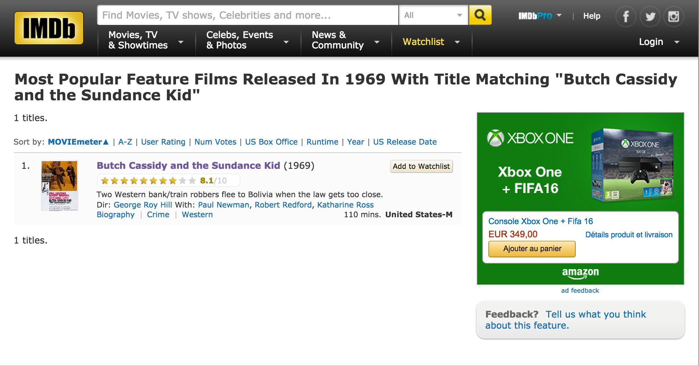

## Introduction

In this analysis, we will have a look at the 100 highest-grossing films in Canada and the United States. The film titles as well as its release year, number of tickets sold, and adjusted gross income will be scraped from [this Wikipedia page](https://en.wikipedia.org/wiki/List_of_highest-grossing_films_in_Canada_and_the_United_States). We then obtain additional data on the films from IMDB. While there is a convenient R package called **omdbapi** that would be useful here and is downloadable from github, we will instead be a bit creative and scrape the data from IMDB. All code is included in this document so as to make the study fully reproducible.

## Getting the Data

```{r, message=FALSE}
# Import the web scraping package
library(rvest)
```

We read the HTML for the Wikipedia page and extract the first HTML table as an R data frame called **table**.

```{r}
# Read the HTML
doc <- read_html('https://en.wikipedia.org/wiki/List_of_highest-grossing_films_in_Canada_and_the_United_States')

# Grab the wikitables
nodes <- html_nodes(doc, '.wikitable')

# Convert the first HTML table to a data frame
table <- html_table(nodes[[1]])
```

## A First Look

```{r}
# Rename columns
names(table)[4] <- 'TicketsSold'
names(table)[5] <- 'AdjustedGross'

head(table)
summary(table)
```

There are 5 columns and 100 rows. As stated on the Wikipedia page, "inflation-adjustment is mostly done by multiplying estimated admissions by the latest average ticket price. Where admissions are unavailable, adjustment is based on the average ticket price for when each film was released (taking into account rereleases where applicable)." 
The TicketsSold and AdjustedGross variables are currently character variables, but we would like them to be numeric. In addition, the AdjustedGross amounts all contain a '$' character that should be removed.

```{r}
# Remove '$' from AdjustedGross and convert to numeric
table$AdjustedGross <- as.numeric(gsub('\\$|,', '', table$AdjustedGross))

# Remove characters from one entry
table$TicketsSold[15] <- strsplit(table$TicketsSold[15], ' ')[[1]][3]

# Remove commas from TicketsSold and convert to numeric
table$TicketsSold <- as.numeric(gsub(',', '', table$TicketsSold))
```

## Data Processing

In order to obtain all the movies' IMDB pages, we will first access the IMDB search page for the movie. Each page link looks like:

*http://www.imdb.com/search/title?release_date=1955,1955&title=Lady%20and%20the%20Tramp&title_type=feature*

Therefore, we need to re-format the movie title; this reformatted title will be a new variable in the data frame called **FormatTitle**.

```{r}
# Replace white space and apostrophes
table$FormatTitle <- gsub(' ', '%20', table$Title)
table$FormatTitle <- gsub('\'', '%27', table$FormatTitle)
```

### Exceptions
The Wikipedia table data originates from Box Office Mojo, and there are differences between several movie titles and release dates on Box Office Mojo and IMDB. These are handled individually below. This case handling does present issues related to scalability. If we were attempting to do this for e.g. 1000 movies, it would be unreasonable to correct all possible issues by hand. What I could do in this case, is run the code in a try-except structure, so if one film fails, the code will continue.

```{r}
# Star Wars: The Force Awakens title to Star Wars: Episode VII - The Force Awakens
table$FormatTitle[11] <- 'Star%20Wars:%20Episode%20VII%20-%20The%20Force%20Awakens'

# The year for the movie title Fantasia differs on the Wikipedia page - this was a multiple release film
table$Year[23] <- 1940

# Ghostbusters - original title is 'Ghost Busters'
table$FormatTitle[34] <- 'Ghost%20Busters'

# Around the World in 80 Days written "Eighty"
table$FormatTitle[49] <- 'Around%20The%20World%20In%20Eighty%20Days'

# National Lampoon's Animal House is called 'Animal House' in IMDB
table$FormatTitle[60] <- 'Animal%20House'

# M*A*S*H is written MASH in IMDB
table$FormatTitle[87] <- 'MASH'
```

## Scraping IMDB for Movie Ratings

We take these formatted movie titles and access each of their IMDB search pages. An example of this search page is shown here for **Star Wars: Episode VI - Return of the Jedi**:


We use the movies' search pages to scrape the IMDB ratings. The function **movieRating** below will do this.

```{r}
movieRating <- function(year, title){
        
        # Load the XML library
        library(XML)
        
        # The link with the IMDB search results from querying the movie title
        url <- paste0('http://www.imdb.com/search/title?release_date=', year, ',', year, '&title=', title, '&title_type=feature')
        doc <- htmlParse(url)
        
        # Get the movie rating from this search page
        rating <- xpathSApply(doc, "//span//span[@class='value']", xmlValue)
        as.numeric(rating)
}
```

We loop over all of our highest-grossing movie titles, obtain their rating, and add it to the **table** dataframe:

```{r, message=FALSE, warning=FALSE, cache=TRUE}
for (i in 1:100){
        rating <- movieRating(table$Year[i], table$FormatTitle[i])
        table$IMDBrating[i] <- rating
}

```

## Exploratory Plotting

First, let's have another look at our data frame:

```{r}
print(head(table))
```

We can first plot the estimated number of tickets sold versus the IMDB rating. I've done this by creating a Shiny application, which I have embedded here. You can hover over each of the points, and the relevant movie title and number of tickets sold will be displayed below the plot.

```{r, echo=FALSE, message=FALSE}
library(shiny)
library(shinyapps)
shinyApp(
        ui <- fluidPage(
                fluidRow(
                        column(width = 12,
                        plotOutput("plot1", height = 350, hover = hoverOpts(id ="plot_hover"))
        )
    ),
                fluidRow(
                        column(width = 5,
                        verbatimTextOutput("hover_info")
        )
    )
),

        server <- function(input, output) {
                output$plot1 <- renderPlot({
                plot(table$IMDBrating, as.numeric(table$TicketsSold)/(1000000), ylab='Tickets Sold (millions)', xlab='IMDB Rating', pch=19)

    })
                output$hover_info <- renderPrint({
                        if(!is.null(input$plot_hover)){
                                hover=input$plot_hover
                                dist=sqrt((10*(hover$x-table$IMDBrating))^2+(hover$y-(as.numeric(table$TicketsSold)/(1000000)))^2)
                                if(min(dist) < 5){print(table$Title[which.min(dist)]); 
                                                      print(paste0('Tickets Sold (millions): ',round(table$TicketsSold[which.min(dist)]/1000000, 2)))}
        }
    })
        }
)
```

Here is another interactive plot which displays the IMDB rating by film rank (Rank = 1 means the highest-grossing film, and Rank = 100 is the 100th highest-grossing film). Hovering over each of the points prints the movie title and the film's rank. We have fit a simple linear regression, which seems to show only a slight negative correlation, so that movies with a higher rank - or those that are higher-grossing, tend to have only slightly higher IMDB ratings.

```{r, echo=FALSE, message=FALSE}
library(shiny)
library(shinyapps)
shinyApp(
        ui <- fluidPage(
                fluidRow(
                        column(width = 12,
                        plotOutput("plot1", height = 350, hover = hoverOpts(id ="plot_hover"))
        )
    ),
                fluidRow(
                        column(width = 5,
                        verbatimTextOutput("hover_info")
        )
    )
),

        server <- function(input, output) {
                output$plot1 <- renderPlot({
                plot(table$Rank, table$IMDBrating, ylab='IMDB Rating', xlab='Film Rank', pch=19)
                abline(h=mean(table$IMDBrating), lty=3, col='darkblue', lwd=2)
                fit <- lm(IMDBrating~Rank, data=table)
                lines(predict(fit), col='red', lwd=2)

    })
                output$hover_info <- renderPrint({
                        if(!is.null(input$plot_hover)){
                                hover=input$plot_hover
                                dist=sqrt((hover$x-table$Rank)^2+(hover$y-table$IMDBrating)^2)
                                if(min(dist) < 1){print(table$Title[which.min(dist)]);
                                                        print(paste0('Film Rank: ', table$Rank[which.min(dist)]))
                                                        }
        }
    })
        }
)
```

## Retrieving More Variables

It could be interesting to scrape more data about the films from IMDB and add these to our data frame. For instance let's add the following:

- Rating (G, PG, PG-13, R, ...)
- Length (in minutes)
- Genre (Adventure, Comedy, Family, Fantasy, Drama, ...)

The function **MovieAttr** obtains these attributes:
```{r}
MovieAttr <- function(year, title){
        
        # Load the XML library
        library(XML)
        
        # The link with the IMDB search results from querying the movie title
        url <- paste0('http://www.imdb.com/search/title?release_date=', year, ',', year, '&title=', title, '&title_type=feature')
        doc <- htmlParse(url)
        
        # Get the movie's rating (G, PG, R, ...)
        # Grabbing element 1 of the vector handles the "Ghost" case where 2 attributes are returned
        movie_rating <- xpathSApply(doc, "//span[@class='certificate']//span", xmlGetAttr, 'title')
        if (length(movie_rating) == 0){
                movie_rating <- 'UNKNOWN'
        }
        else{
                movie_rating <- movie_rating[1]
        }
        
        
        # Get the movie's length in minutes, delete "mins", convert to numeric
        # Grabbing element 1 of the vector handles the "Ghost" case where 3 xmlValues are returned
        movie_length <- xpathSApply(doc, "//span[@class='runtime']", xmlValue)
        movie_length <- (gsub(' mins.', '', movie_length))[1]
        
        # Get the list of the movie's genres
        genres <- xpathSApply(doc, "//span[@class='genre']//a", xmlValue)
        
        c(movie_rating, movie_length, genres)
}
```

I have added a statement for those movies that may not have a rating; these will now have "UNKNOWN" ratings. We can use this function to obtain the data for all 100 movies.

```{r, warning=FALSE, message=FALSE}
movie_ratings <- character(100)
movie_lengths <- numeric(100)
movie_genres <- character()
for (i in 1:100){
        attr <- MovieAttr(table$Year[i], table$FormatTitle[i])

        movie_ratings[i] <- attr[1]  
        
        movie_lengths[i] <- as.numeric(attr[2])
        genres <- list(attr[-(1:2)])
        movie_genres <- c(movie_genres, genres)
}
```

These columns can now be added to our **table** data frame.

```{r}
table$rating  <- movie_ratings
table$length <- movie_lengths
table$genres <- movie_genres
```

Printing the last few rows of the data frame:

```{r}
tail(table)
```

We notice that there are at least a few films that have "APPROVED" ratings and some that are "UNRATED". Let's see how many types of movie ratings there are:

```{r}
unique(table$rating)
```

Let's see how many films fall into the "APPROVED" category:

```{r}
sum(table$rating == 'APPROVED')
```

One quarter of our movies have "APPROVED" ratings. For example, see this search page for **Gone With the Wind** below:


"Approved" ratings are found for those films released before the current ratings system was put in place. According to [this link](http://www.hometheaterinfo.com/mpaa.htm), the approved/not approved system was based on guidelines formulated by the Hayes Commission that were intended to ensure films were moral.

Let's see how many films are "Unrated":

```{r}
sum(table$rating == 'UNRATED')
```

There is at least one film with an "UNKNOWN" rating:

```{r}
table$Title[table$rating == 'UNKNOWN']
```

These two films have a page that look like this:



Next to the movie's running time, it says "United States-M". In the case of the movie **Love Story**, the rating reads "United States-GP." According to [this Wikipedia page](https://en.wikipedia.org/wiki/Motion_Picture_Association_of_America_film_rating_system) on MPAA's rating system, for movies released between 1968 and 1970, the "M" rating meant "Mature audiences - parental guidance advised", and this rating was changed to "GP" into 1970 and finally "PG" in 1972. Therefore, we will replace these two movies' ratings with "PG."

```{r}
table$rating[table$rating=='UNKNOWN'] <- 'PG'
```

## Visualizing the New Variables

Let's histogram the movie lengths:

```{r}
hist(table$length, xlab='length (mins)', ylab='', main='Movie length (in minutes) for the top 100 highest-grossing\n films in the U.S. and Canada', xaxp=c(min(table$length), max(table$length), 8))
```

The shortest and longest films are:

```{r}
shortest <- paste0(table$Title[which.min(table$length)],': ' ,table$length[which.min(table$length)], ' mins.')
longest <- paste0(table$Title[which.max(table$length)],': ' ,table$length[which.max(table$length)], ' mins.')
c(shortest, longest)
```

The shortest film is an animated family film intended for children. Family films may tend to have shorter runtimes. Let's look into this by first barplotting the genres.

```{r}
genres <- unique(unlist(table$genres))
genres
```

There are 20 genres represented in our 100 films, where each film is categorized under at least one genre. Let's tabulate counts for each of the genres.

```{r}
# Data frame to store genre categories and counts
genre_counts <- data.frame(genre = genres, counts = rep(0, length(genres)))

# Create vector of genres by unlisting
unlist_gens <- unlist(table$genres)

# Loop through the vector of genres and count each one's occurences
for (i in 1:length(unlist_gens)){
        w <- which(unlist_gens[i] == genre_counts[,1])
        genre_counts[w,2] <- genre_counts[w,2] + 1
}

# Reorder the data frame by decreasing number of counts
genre_counts <- genre_counts[order(genre_counts$counts, decreasing=TRUE),]
```

We can bar plot these counts:

```{r, fig.height=6}
x <- barplot(genre_counts$counts, xaxt='n', ylab='Counts', yaxp=c(0,50,5), col='plum3')
text(cex=1, x=x+0.55,y=-1.25, labels=genre_counts$genre, xpd=TRUE, srt=45, pos=2)
text(x = x, y = genre_counts$counts+1, label = genre_counts$counts, pos = 1, cex = 0.6, col = "snow")
```

Almost half of the top-grossing films are classified as "Adventure" films. About one-quarter of the films are categorized under "Fantasy", and the same proportion are considered "Family" films. Just out of curiosity, the one "Sport" film and the one 'Music' film are:

```{r}
sport_film <- which(sapply(table$genres, function(gen) 'Sport' %in% gen))
music_film <- which(sapply(table$genres, function(gen) 'Music' %in% gen))
table$Title[sport_film]
table$Title[music_film]
```

### Family film vs. Non-Family film lengths

In order to statistically comment on the difference in movie length between "Family" films and films not categorized under "Family", we can perform a T-test. Two-sample T-tests are used in the case of small sample sizes (low degrees of freedom) where they test the null hypothesis that the two groups have equal means. As sample sizes increase, the T quantiles approach the standard normal quantiles, and we could instead run a Z-test.

Let's first look at the mean movie length for "Family" films:

```{r}
family <- which(sapply(table$genres, function(gen) 'Family' %in% gen))
family_lengths <- table$length[family]
mean(family_lengths)
```

while the mean movie length for non-family films is:

```{r}
no_family_lengths <- table$length[-family]
mean(no_family_lengths)
```

The question of interest is: how likely is it to obtain the mean value for non-family films under the assumption that its true distribution is given by that of the family films? We quantify this with the T statistic, a measure of how many T quantiles our measured non-family sample mean is from the "Family" sample mean. The T statistic implies a p-value, which is interpreted as the probability of obtaining a T statistic at least as extreme as the one calculated. A small p-value means we can rule out the null hypothesis in favor of the alternative. For this T-test, the alternative hypothesis is simply that the true difference in the mean movie length for our two samples is different from 0. Let's run the T-test and interpret the output:

```{r}
t.test(no_family_lengths, family_lengths, var.equal=FALSE)
```

The Welch's T-test is used in cases where the underlying populations of the two samples are not expected to have equal variances. However, the results from the Welch's T-test converge to those of the Student's T-test for equal population variances; this robustness is why we've chosen to use it here. As well, this T-test, just like the Student's T-test assumes normality (or close to normality) of the populations. 

The measured T statistic is 3.38 under 41.6 degrees of freedom, implying a two-sided p-value of 0.0016. A two-sided p-value gives the probability of obtaining a T statistic at least as extreme as the one calculated, or in our case, larger than 3.38 or smaller than -3.38. The 95% confidence interval for the difference in means lies completely above 0, indicating that non-family films have longer film lengths than family films with a type-I error rate alpha = 0.05. In fact, the T-test p-value of 0.0016 indicates that we can rule out the null hypothesis in favor the alternative at *that* level (a stronger statement since this error rate is smaller).

## Final Remarks

This analysis gave us a fun opportunity to scrape data from the web. However, one challenge of this study is dealing with possible exceptions. If we were to run this analysis on thousands of films, we would need to account, for instance, for the possibility that some data we are attempting to scrape may not be available. There are many more insights we could gather from this kind of data. For example, if we had a (much) larger film dataset, it would be really interesting to do some predictive analytics. We could train a logistic regression or random forest model to predict the movie rating (Approved, PG, PG_13, R, G, Unrated) based on predictors like the movie genres, the length, and the release year.
